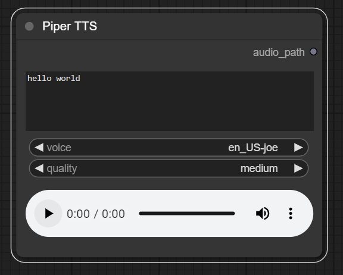

# ComfyUI PiperTTS

- Convert Text-to-Speech inside ComfyUI using [Piper](https://github.com/rhasspy/piper)
- Refer to the list of [supported voices](https://github.com/rhasspy/piper/blob/master/VOICES.md) before using this node

<p align="center">
  
</p>

## Installation

Navigate to the ComfyUI `/custom_nodes` directory

```bash
git clone https://github.com/yuvraj108c/ComfyUI-PiperTTS
cd ./ComfyUI-PiperTTS
pip install -r requirements.txt
```

## Credits

- [rhasspy/piper](https://github.com/rhasspy/piper)
- [Kosinkadink/ComfyUI-VideoHelperSuite](https://github.com/Kosinkadink/ComfyUI-VideoHelperSuite)
